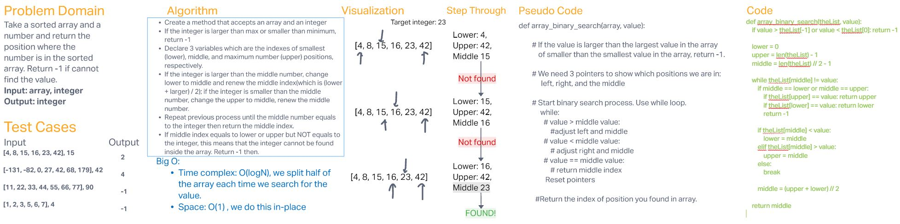

# Binary Search of Sorted Array

Use binary search method to find a target integer in a sorted array and return the position found in the array.
Return -1 if the target number cannot be found.

## Whiteboard Process

## Approach & Efficiency

Everytime we try to find the target value, we cut half of the array where the target value could be at.
Therefore, the time complexity is O(logN). The space complexity is O(1) because we iterate the same given array.
