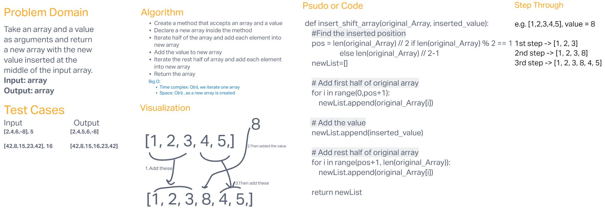

# Array Insert Shift

Take an array and a value as arguments and return the a new array with the new value inserted at the middle of the input array.

## Whiteboard Process

## Approach & Efficiency

Use forloop to iterate the input array and insert a value.

Time complexity is O(n) and space complexity is O(n) since a new array is created and reurn.

