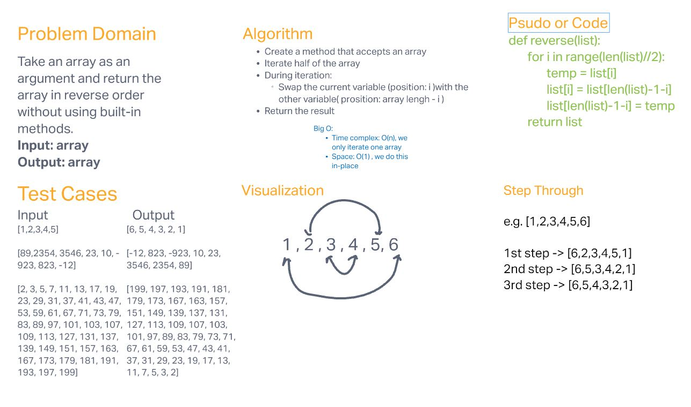

# Reverse and Array

Take an array as an argument and return the array in reverse order without using built-in methods.

## Whiteboard Process

## Approach & Efficiency

Use forloop to iterate the input array and swap values. Big O of time is O(n) and Big O of space is O(1) since it's in-place.
