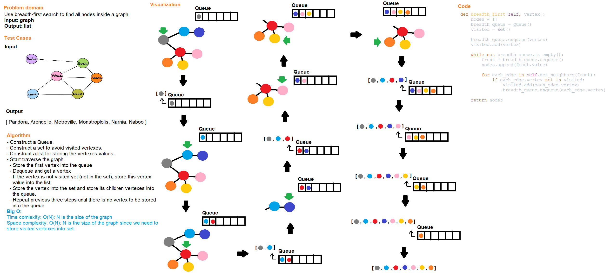

# Code Challenge Class 36
## Graph Breadth-first Search
Implement a breadth-first traversal on a graph

## Challenge Summary
All tests for this challenge should be passed.

## Whiteboard Process

## Approach & Efficiency
- Construct a Queue, a set for visited vertexes, and a list for storing the vertexes values
- Traverse the graph
- Store the first vertex into the queue
- Dequeue and get a vertex
- If the vertex is not visited yet(not in the set), store this vertex value into the list
- Store the vertex into the set and store its children vertexes into the queue
- Repead previous three setps until there is no vertex to be stored into the queue
- Return the list of vertex values

Big O:

Time complexity: O(N): N is the size of the graph

Space complexity: O(N): N is the size of the graph since we need to store visited vertexes into set.

## Solution
Run the test files for API functions below and check if test cases are all passed.

### API

[graph](../../data_structures/graph.py)
- breadth_first(vertex): start with the given vertex to find all connected vertexes using breadth-first search algorithm.

## Testing

Go to [test_graph_breadth_first](../../tests/code_challenges/test_graph_breadth_first.py) and run ``pytest``.

