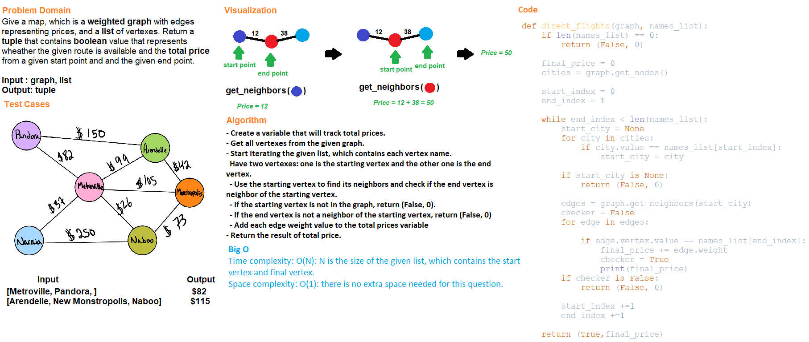

# Code Challenge Class 37
## Graph Business Trip
## Challenge Summary
Given a business trip itinerary and use graph to find possible routes and the total cost for the route.

All tests for this challenge should be passed.

## Whiteboard Process

## Approach & Efficiency
- Create a variable that will track total prices.
- Get all vertexes from the given graph.
- Start iterating the given list, which contains each vertex name.
  Have two vertexes: one is the starting vertex and the other one is the end vertex.
  - Use the starting vertex to find its neighbors and check if the end vertex is neighbor of the starting vertex.
  - If the starting vertex is not in the graph, return (False, 0).
  - If the end vertex is not a neighbor of the starting vertex, return (False, 0)
  - Add each edge weight value to the total prices variable
- Return the result of total price.

Big O:

Time complexity: O(N): N is the size of the given list, which contains the start vertex and final vertex.

Space complexity: O(1): there is no extra space needed for this question

## Solution
Run the test files for API functions below and check if test cases are all passed.

### API

[graph_business_trip](../../code_challenges/graph_business_trip.py)
- direct_flights(graph, names_list): Find possibility of the route for travelling from a start position to the final position in a given list and find the total cost of the route.

## Testing

Go to [test_graph_business_trip](../../tests/code_challenges/test_graph_business_trip.py) and run ``pytest``.

