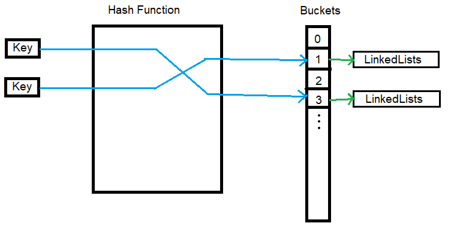

# Code Challenge Class 30 Hash Table Implementation
# Hashtables
Hashtable is a data structure that stores **key** and **value** pairs data.
Unlike dictionary, hashtable will encrypt the key which is called **hash code**,
which will be used as an index in a list-like place called **bucket**.
Each index in the bucket stores the **linked list** that contains bunch of key/value data.

## Challenge
All tests for this challenge should be passed.

## Approach & Efficiency
Set up multiple APIs for Hashtable class.
The Big(O) for time complexity for getting the key/value data is O(1).
The Big(O) for space complexity is O(N), where N is determined by how many elements are being stored into a hashtable.

## API

[Hashtable_class](../../data_structures/hashtable.py)
- set(key, value): Store a key/value pair data into the hashtable
- get(key): Get the specific value based on a given key
- keys(): Get all keys and return a list of those keys
- contains(key): Check if a key exists inside a hashtable
- hash(key): Generate a hash code based on a given key

## Testing

Go to [test_hashtable](../../tests/data_structures/test_hashtable.py) and run ``pytest``.

