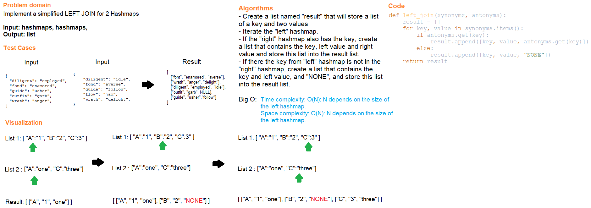

# Code Challenge Class 33
## Hashtable left join
Implement a simplified LEFT JOIN for 2 Hashmaps.

## Challenge Summary
All tests for this challenge should be passed.

## Whiteboard Process

## Approach & Efficiency
- Create a list named "result" that will store a list of a key and two values
- Iterate the "left" hashmap.
- If the "right" hashmap also has the key, create a list that contains the key, left value and right value and store this list into the result list.
- If there the key from "left" hashmap is not in the "right" hashmap, create a list that contains the key and left value, and "NONE", and store this list into the result list.

Big O:

Time complexity: O(N): N depends on the size of the left hashmap.
Space complexity: O(N): N depends on the size of the left hashmap.

## Solution
Run the test files for API functions below and check if test cases are all passed.

### API

[hashtable_left_join](../../code_challenges/hashtable_left_join.py)
- left_join(synonyms, antonyms): return a list that contains value from antonyms left join synonyms
- right_join(synonyms, antonyms): return a list that contains value from synonyms right join antonyms

## Testing

Go to [test_hashtable_left_join](../../tests/code_challenges/test_hashtable_left_join.py) and run ``pytest``.

