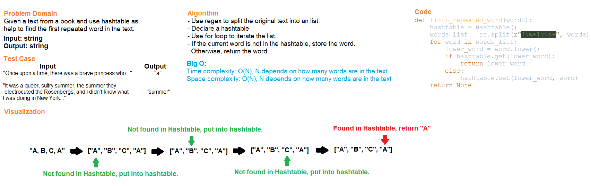

# Code Challenge Class 31
## Hashtable repeated words
Find the first repeated word in a book/text.

## Challenge Summary
All tests for this challenge should be passed.

## Whiteboard Process

## Approach & Efficiency
Use regex to split the original text into a list and use hashtable to store unrepeated words.
If a word is found in a hastable already, return the word.

Time complexity is O(N), where N depends on how many words are in the text.
Space complexity is O(N), where N depends on how many words are in the text.

## Solution
Run the test files for API functions below and check if test cases are all passed.

### API

[hashtable_repeated_word](../../code_challenges/hashtable_repeated_word.py)
- first_repeated_word(words): find the first repeated word in the text

Stretch goals:
- count_words(words): return a count of each of the words in the provided string
- get_most_frequent(words): return a list of the words most frequently used in the provided string

## Testing

Go to [test_hashtable_repeated_word](../../tests/code_challenges/test_hashtable_repeated_word.py) and run ``pytest``.

