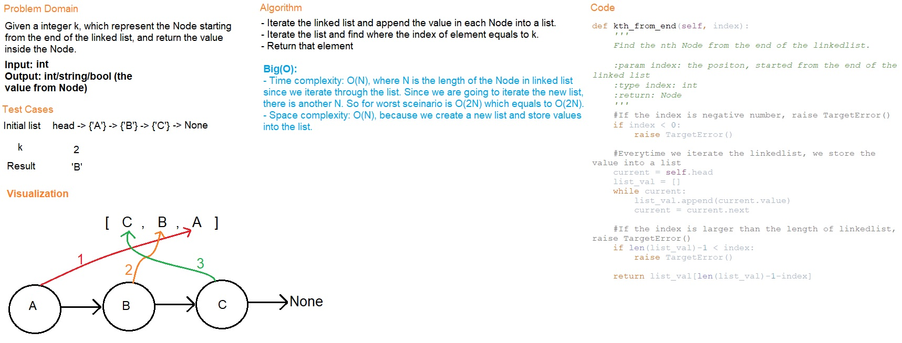

# Code Challenge Class 07
# Linked List kth

## Challenge
All tests for this challenge should be passed.

## Whiteboard Process

## Approach & Efficiency
Create a list and add each value into the list while iterating the linked list.
The time complexity is O(N), where N is the length of the Node
The Space complexity is O(N), since a list is created.

## Solution
Run the test files for API functions below and check if test cases are all passed.

### API

[linked_list class](../../data_structures/linked_list.py)
- includes(val): Check if a Node with target value is in the linkedlist.
- insert(val): Insert a new Node at the front of linkedlist.
- append(val): Add a new Node at the end of linkedlist.
- insert_before(a,b): Insert a new Node 'b' before an existed Node 'a'.
- insert_after(a,b): Insert a new Node 'b' after an existed Node 'a'.
- delete(a): Delete an existed Node 'a'.
- kth_from_end(n): Find the nth Node from the end of the linkedlist.

[linked_list_zip](../../code_challenges/linked_list_zip.py)
- zip_lists(a,b): Merge two linked lists into one linked lists.

## Testing

Go to **[test/data_structures](../../tests/data_structures)** folder and run ``pytest`` for each following test module.

[test_linked_list](../../tests/data_structures/test_linked_list.py) (Code Challenge 05)

Go to **[test/code_challenges](../../tests/code_challenges)** folder and run ``pytest`` for each following test module.

[test_linked_list_insertions](../../tests/code_challenges/test_linked_list_insertions.py) (Code Challenge 06)

[test_linked_list_kth](../../tests/code_challenges/test_linked_list_kth.py) (Code Challenge 07)

[test_linked_list_zip](../../tests/code_challenges/test_linked_list_zip.py) (Code Challenge 08)

