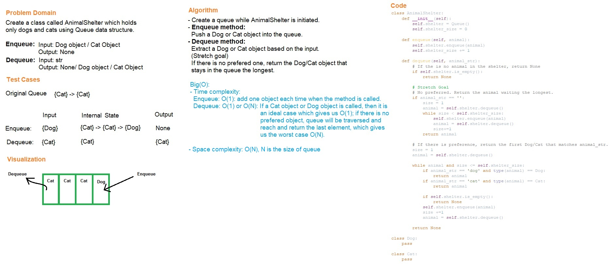

# Code Challenge Class 12
# First-in, First out Animal Shelter
This code challenge is to construct an AnimalShelter class and uses a queue to store and extract Dog or Cat objects.

## Challenge
The AnimalShelter class operates using a first-in, first-out approach.

## Whiteboard Process

## Approach & Efficiency
- Create two classes: Dog and Cat.
- Create a class named AnimalShelter that contains a queue data structure.
- Use queue for enqueue and dequeue methods.
- Enqueue method takes a Dog or Cat object as input and will add the object into queue.
- Dequeue method takes a string as input and will either return the prefered Dog or Cat object or None.
- Stretch Goal: If a cat or dog isn't preferred, return whichever animal has been waiting in the shelter the longest.
- Time complexity:
  - Enqueue: O(1): we only add one object each time.
  - Dequeue: O(1): remove a class each time.
- Space complexity:
  - O(N): where N equals to the size of the queue

# Solution
## API
[stack_queue_animal_shelter](../../code_challenges/stack_queue_animal_shelter.py)
  - enqueue() : Add an object into the queue.
  - dequeue() : Remove the prefered animal object from the queue.
    - **strech goal: line 39-46.**
    If a cat or dog isn’t preferred, return whichever animal has been waiting in the shelter the longest.

## Tests
Go to the test file to find the following tests file and run pytest

[test_stack_queue_animal_shelter](../../tests/code_challenges/test_stack_queue_animal_shelter.py)

