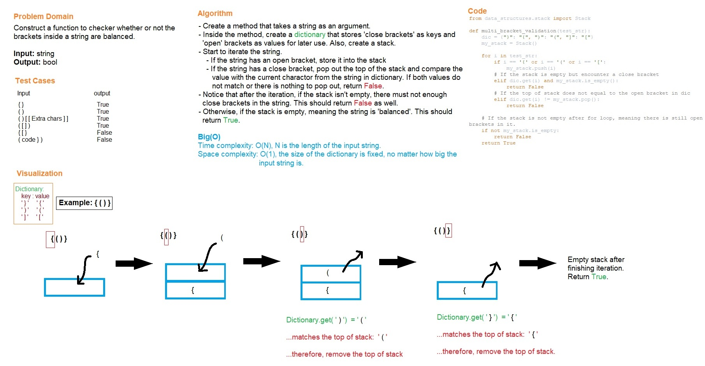

# Code Challenge Class 13
# Multi-bracket Validation

## Challenge
This code challenge is to check whether or not brackets inside a string is balanced.

## Whiteboard Process

## Approach & Efficiency
- Create a method that takes a string as an argument.
- Inside the method, create a dictionary that stores 'close brackets' as keys and 'open brackets' as values.
- Also, create a stack to store open brackets only.
- Iterate the input string.
  - If the string has an open bracket, store it into the stack.
  - If the string has a close bracket, pop out the top and compare this value with current char value from the string in dicionary.
  If both values do not match or there is nothing to pop out, return False.
- After iteration, if stack is not empty, meaning brackets are not balanced, then return False. Otherwise, return True.
- Time complexity: O(N), N is the length of the input string.
- Space complexity: O(1), the size of the dictionary is fixed, no matter how big the input string is.

# Solution
## API
[stack_queue_brackets](../../code_challenges/stack_queue_brackets.py)
  - multi_bracket_validation(): takes in a string as an argument and check whether the brackets inside the string is balanced.

## Tests
Go to the test file to find the following tests file and run pytest

[test_stack_queue_brackets](../../tests/code_challenges/test_stack_queue_brackets.py)

