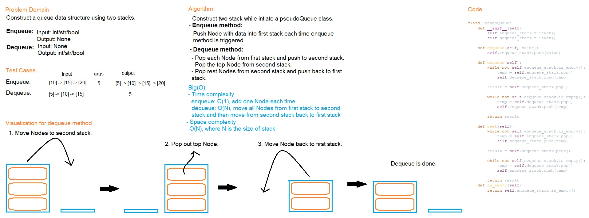

# Code Challenge Class 11
# Implement a Queue using two Stacks
This code challenge implements a queue using two stacks.

## Challenge
Construct a PseudoQueue class that works as a queue using two stacks instead of using any method from Queue class from previous Code Challenge.

## Whiteboard Process

## Approach & Efficiency
- Create two stacks for enqueue and dequeue methods.
- One is used for storing data and the other stack is used for extracting data.
- Every time while popping out the data, Nodes in stack that stores data will be moved to another stack which is used for extracting data.
After finishing extracting data, those Nodes in second stack will be moved back to the previous stack.
- Time complexity:
  - Enqueue: O(1): we only add one Node each time.
  - Dequeue: O(N): N = n1(Nodes in first stack move to second stack) + n2(Nodes in second stack move back to first stack)
- Space complexity:
  - O(N): where N equals to the size of a stack

# Solution
## API
[stack_queue_pseudo](../../code_challenges/stack_queue_pseudo.py)
  - enqueue() : Add new Node into the queue.
  - dequeue() : Remove the first Node from the queue.
  - peek() : Show the first Node from the queue, but will not be removed.
  - is_empty() : Check if the queue is empty.

## Tests
Go to the test file to find the following tests file and run pytest

[test_stack_queue_pseudo](../../tests/code_challenges/test_stack_queue_pseudo.py)

