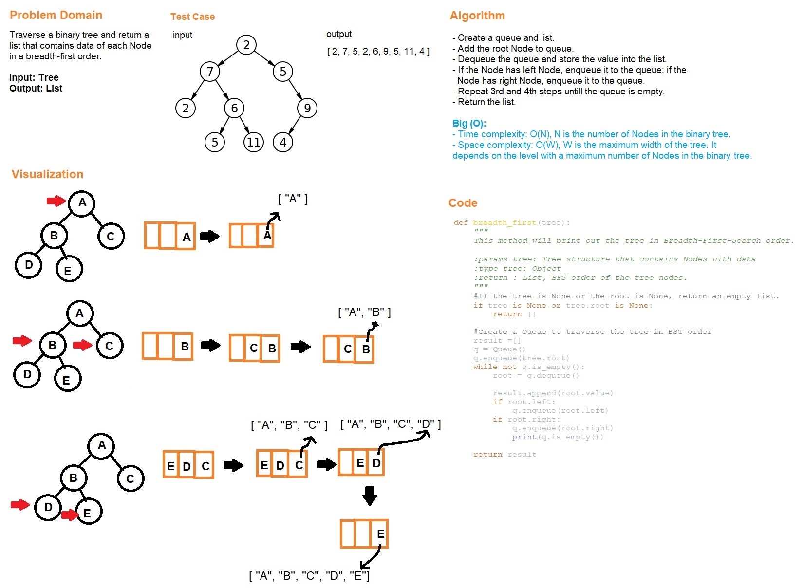

# Code Challenge Class 16
# Breadth-first Traversal

## Challenge Summary
Create a method that traverse a binary tree in a breadth-first traversal order.

## Whiteboard Process

## Approach & Efficiency
- Create a queue and a list.
- Add the root Node to queue.
- Dequeue the queue and store the value into the list.
- If the Node has left Node, enqueue it to the queue; if the Node has right Node, enqueue it to the queue.
- Repeat previous two steps until the queue is empty.
- Return the list.
- Time complexity: O(N), N is the number of Nodes in the binary tree.
- Space complexity: O(W), W is the maximum width of the tree. It depends on the level with a maximum number of Nodes in the binary tree.

# Solution
## API
[tree_breadth_first](../../code_challenges/tree_breadth_first.py)
  - breadth_first(tree): takes a tree as input and return a list with breath-first traversal order of the tree.

## Tests
Go to the test file to find the following tests file and run pytest

[test_tree_breadth_first](../../tests/code_challenges/test_tree_breadth_first.py)

