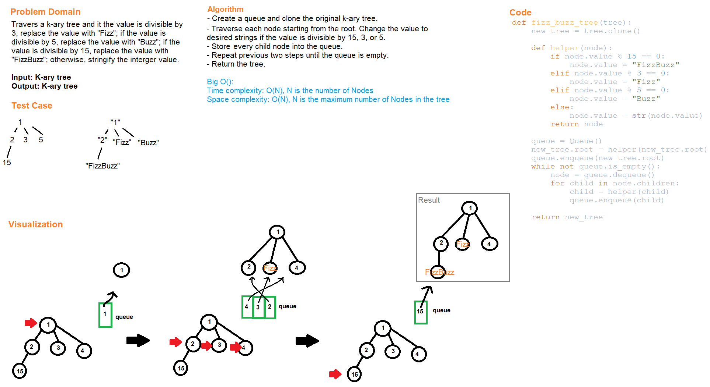

# Code Challenge Class 18
# Tree Fizz Buzz

## Challenge Summary
Conduct "FizzBuzz" on a k-ary tree while traversing through it to create a new tree.

## Whiteboard Process

## Approach & Efficiency
- Create a queue and make copy of the original tree.
- Traverse each node starting from the root. Change the value to desired strings if the value is divisible by 15, 3, or 5.
- Store every child node into the queue.
- Repeat previous two steps until the queue is empty
- Return the tree.
- Time complexity: O(N), N is the number of Nodes in the tree.
- Space complexity: O(N), N is the maximum number of Nodes in the tree.

# Solution
## API
[tree_fizz_buzz](../../code_challenges/tree_fizz_buzz.py)
  - fizz_buzz_tree(tree): takes a k-ary tree as input and return the desired modified k-ary tree if the value in each is divisible by 15, 3, or 5.

## Tests
Go to the test file to find the following tests file and run pytest

[test_tree_fizz_buzz](../../tests/code_challenges/test_tree_fizz_buzz.py)

