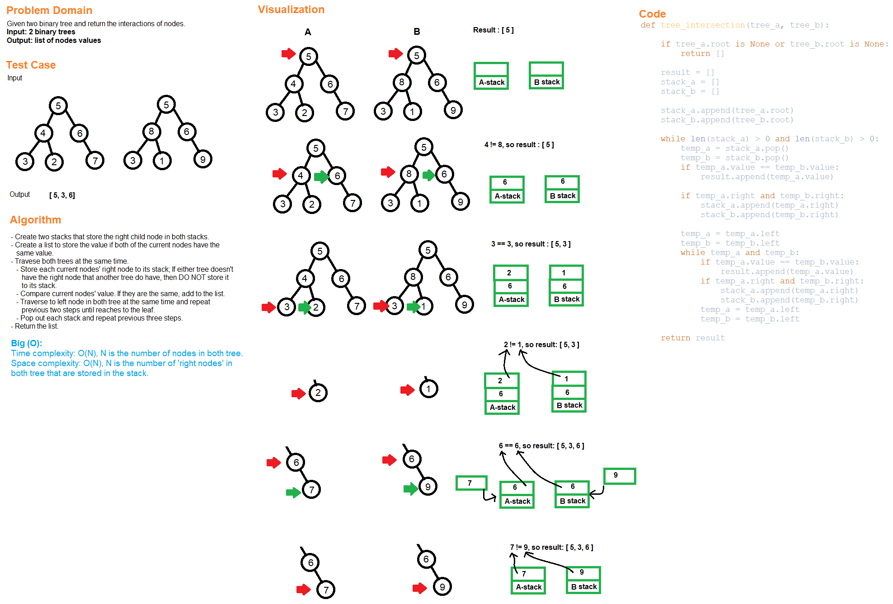

# Code Challenge
# Tree Intersection

## Challenge Summary
Create a method to find the intersections between two binary trees.

## Whiteboard Process

## Approach & Efficiency
- Create two stacks to store the right child nodes for both stacks
- Create a list to store the value if both of the current nodes have the same value.
- Traverse both trees at the same time.
  - Store each current nodes' right node to its stack;
  if either tree doesn't have the right node that another tree do have,
  then DO NOT store any of them into the stack.
  - Compare current nodes' values. If they are the same, add to the list.
  - Travers to left node in both tree at the same time and repeat
  previous two steps until reaches to the leaf.
  - Pop out both stacks and repeat previous three steps.
- Time complexity: O(N), N is the number of nodes in both tree.
- Space complexity: O(N),
N is the number of 'right nodes' in both tree that are stored in the stack.

# Solution
## API
[tree_intersection](../../code_challenges/tree_intersection.py)
  - tree_intersection(tree_a, tree_b): takes in two trees and return the intersections of two trees.

## Tests
Go to the test file to find the following tests file and run pytest

[test_tree_intersection](../../tests/code_challenges/test_tree_intersection.py)

