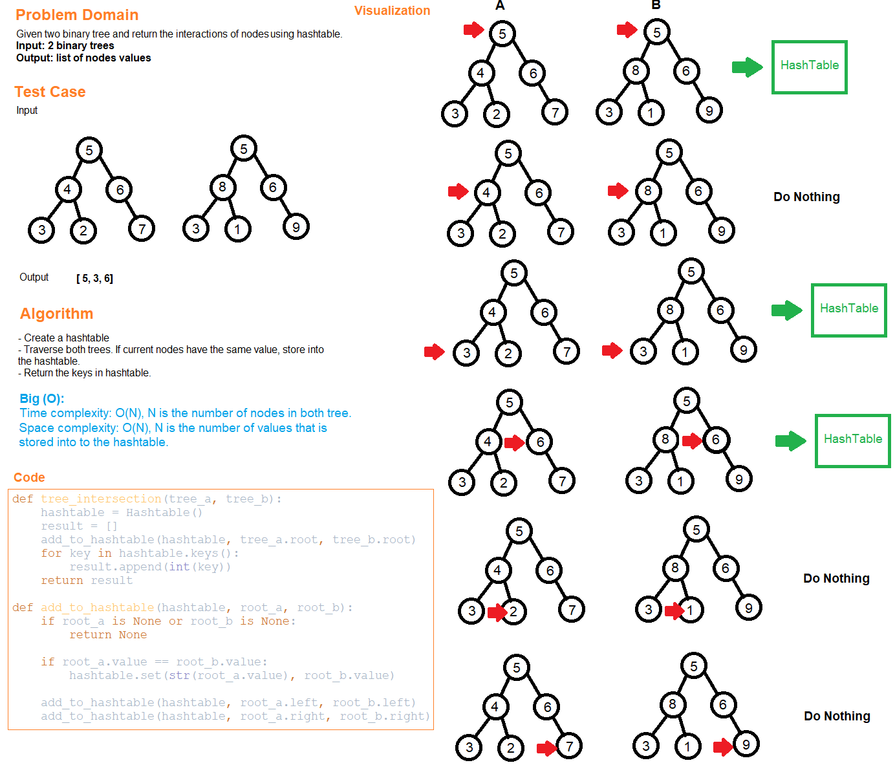

# Code Challenge 32
# Tree Intersection

## Challenge Summary
Create a method to find the intersections between two binary trees using hashtable.

## Whiteboard Process

## Approach & Efficiency
- Create a hashtable.
- Traverse both trees. If current nodes have the same value, store the value into the hashtable.
- Return the keys in hashtable.
- Time complexity: O(N), N is the number of nodes in both tree
- Space complexity: O(N), N is the number of values that is stored into the hashtable.

# Solution
## API
[tree_intersection](../../code_challenges/tree_intersection.py)
  - tree_intersection(tree_a, tree_b): takes in two trees and return the intersections of two trees.

## Tests
Go to the test file to find the following tests file and run ``pytest``.

[test_tree_intersection](../../tests/code_challenges/test_tree_intersection.py)

