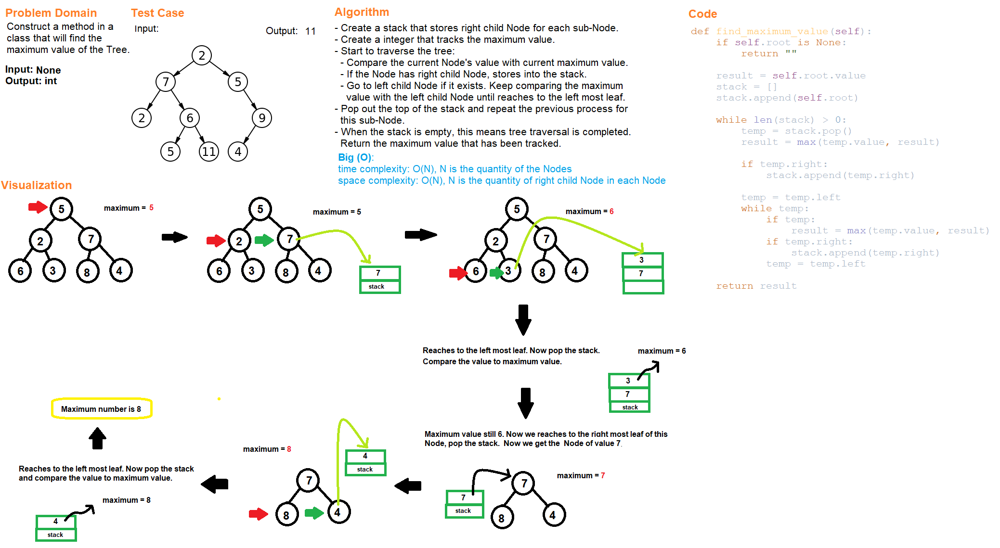

# Code Challenge Class 17
# Tree Max

## Challenge Summary
Construct a method finds the maximum value within a binary tree.

## Whiteboard Process

## Approach & Efficiency
- Create a stack that stores right child Node in each sub-Node.
- Create an integer that tracks the maximum value.
- Start to travers the tree:
  - Compare the current Node's value with current maximum value.
  - If the Node has right child Node, stores into the stack.
  - Go to left child Node if it exists. Keep comparing the maximum value with the left child Node until reaches to the left most leaf.
- Pop out the top of stack and repeat the previous process for this sub-Node.
- When the stack is empty, this means tree traversal is completed. Return the maximum value that has been tracked.
- Time complexity: O(N), N is the quantity of the Nodes.
- Space complexity: O(N*), N* is the quantity of right child Node in each Node.

# Solution
## API
[Binary Tree](../../data_structures/binary_tree.py)
  - find_maximum_value(): find the maximum value within a binary tree.

## Tests
Go to the test file to find the following tests file and run pytest

[test_tree_max](../../tests/code_challenges/test_tree_max.py)

