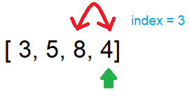

# Blog Notes: Insertion Sort

## Introduction
Insertion sort is a sorting algorithm that will have a "selected value" and compares this value with those unsorted value
on the left while ietrating a list. While iterating a list, we select the element at current index position and compare this value
with the value on the left. If the left value is larger than the current value, we switch those numbers and do the same process until the those left values are smaller or equal to the current value.

## Pseudocode
```
InsertionSort(int[] arr)

    FOR i = 1 to arr.length

      int j <-- i - 1
      int temp <-- arr[i]

      WHILE j >= 0 AND temp < arr[j]
        arr[j + 1] <-- arr[j]
        j <-- j - 1

      arr[j + 1] <-- temp
```

## Whiteboard Process
Sample: [5, 3, 8, 4]

Pass 1:


In the first pass, the selected value is where index = 1, which has the value '3'.
This value is smaller than it's left value, so switch 3 and 5's positions.

Pass 2:


Now the value '3' reaches to the edge of the list. Now we can move to next index.

Pass 3:


The new selected value is '8' now. But since it is larger than it's left value, which is '5',
there is not switching happening in pass 3.

Pass 4:



Noe we move index forward and the selected value is '4'. We compare this value with it's left value, which is '8',
and since '4' is less than '8', we switch those values in the list.

Pass 5:


Now '4' is at it's new position, it needs to be compared with its left value, which is '5'.
Notice that '5' is larger than '4', we switch their positions.

Pass 6:


Now '4' has a new left value to compare with. However, since the left value is '3', which is less than '4',
we stop comparing numbers. Now index will become '4', which is the length of the list, meaning the iteration
is finished and we should have the sorted list: [3, 4, 5, 8].


## Code

Click [sort_insertion](../../python/code_challenges/sort_insertion.py) to see the code.

Go to [test_sort_insertion](../../python/tests/code_challenges/test_sort_insertion.py) to run tests.

```
def insertion_sort(unsorted_list):
    for i in range(1,len(unsorted_list)):
        j = i - 1
        temp = unsorted_list[i]

        while j >= 0 and temp < unsorted_list[j]:
            unsorted_list[j+1] = unsorted_list[j]
            j-=1
            unsorted_list[j+1] = temp
    return unsorted_list
```

## Efficency
- Time: O(N^2): the worst case is that all elements in the list needs to be sorted,
which will compare current selected value with all values on its left.
- Space: O(1): No additional place is needed.
