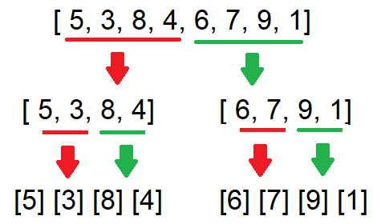
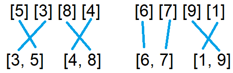
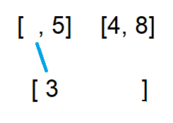
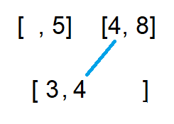
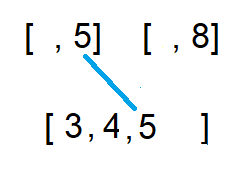
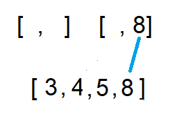
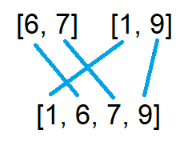
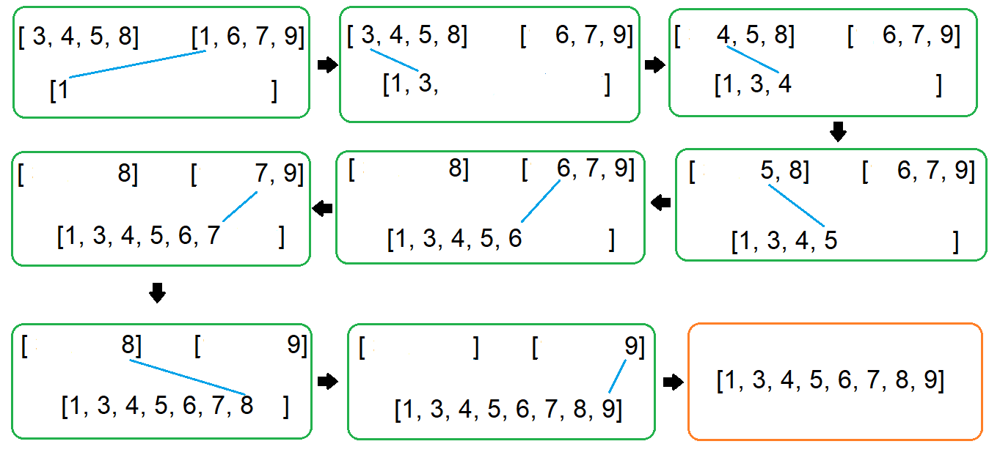

# Blog Notes: Merge Sort

## Introduction
Merge sort is a sorting algorithm that breaks down original unsorted list into sub-lists and start to sort and merge those sub-lists.
This type of algorithm is also called "divide-and-conquer", which is a very common algorithm design paradigm in computer science.

## Pseudo Code
```
ALGORITHM Mergesort(arr)
    DECLARE n <-- arr.length

    if n > 1
      DECLARE mid <-- n/2
      DECLARE left <-- arr[0...mid]
      DECLARE right <-- arr[mid...n]
      // sort the left side
      Mergesort(left)
      // sort the right side
      Mergesort(right)
      // merge the sorted left and right sides together
      Merge(left, right, arr)

ALGORITHM Merge(left, right, arr)
    DECLARE i <-- 0
    DECLARE j <-- 0
    DECLARE k <-- 0

    while i < left.length && j < right.length
        if left[i] <= right[j]
            arr[k] <-- left[i]
            i <-- i + 1
        else
            arr[k] <-- right[j]
            j <-- j + 1

        k <-- k + 1

    if i = left.length
       set remaining entries in arr to remaining values in right
    else
       set remaining entries in arr to remaining values in left
```
## Whiteboard Process
### Pass 1:



The unsorted list will be broken down into sub-lists.


### Pass 2:



After the list is broken down into single sub-list, each sub-list will be compared and merge to its adjacent sub-list as the diagram showed.

### Pass 3:



Now we are going to merge the two sub-lists on left. "3" is the smallest, move "3" into the new list first.



Now move "4" in the second sub-list into the new list since it becomes the smallest number.



After "4" is moved, the number "5" in the first sub-list is now the smallest number and should be moved to the new list.



"8" is the last number here. Add it to the list. Now we have a new sub-list that is sorted.

### Pass 4:



Do the same process with another sub-lists on the right in **Pass 2**.

### Pass 5:



Now we should have two sorted sub-lists and each of them contain four elements.
Do the same process to those two sub-lists to get the completed sorted list.

## Code

Click [sort_merge](../../python/code_challenges/sort_merge.py) to see the code.

Go to [test_sort_merge](../../python/tests/code_challenges/test_sort_merge.py) to run tests.
```
def merge_sort(unsorted_list):
    list_length = len(unsorted_list)
    if list_length > 1:
        mid = list_length // 2
        left = unsorted_list[0:mid]
        right = unsorted_list[mid:list_length]

        merge_sort(left)
        merge_sort(right)
        Merge(left, right , unsorted_list)
    return unsorted_list

def Merge(left, right, unsorted_list):
    left_index, right_index, list_index = 0, 0, 0

    while left_index < len(left) and right_index < len(right):
        if left[left_index] < right[right_index]:
            unsorted_list[list_index] = left[left_index]
            left_index += 1
        else:
            unsorted_list[list_index] = right[right_index]
            right_index += 1
        list_index+=1

    if left_index < len(left):
        unsorted_list[list_index:] = left[left_index:]

    if right_index < len(right):
        unsorted_list[list_index:] = right[right_index:]
```
## Efficency
- Time: O(NlogN): Because we keep dividing the list by two until each sub-list only contains one element,
this takes log_2(N) times. Since we need to compare and merge each sub-list, we need to iterate each node, which is length of the list, N.
Therefore, the total time complexity is O(N*logN).
- Space: O(1): No additional place is needed for merge sort.
