# Blog Notes: Quick Sort

## Introduction
Quick sort is a sorting algorithm that will make sure every value to the left of the "pivot" is smaller and every value to the right
is always larger. We can divide the list into sub-lists to make sure every number has a chance to become the "pivot" so that
we can obtain the sorted list.

## Pseudo Code

```
ALGORITHM QuickSort(arr, left, right)
    if left < right
        // Partition the array by setting the position of the pivot value
        DEFINE position <-- Partition(arr, left, right)
        // Sort the left
        QuickSort(arr, left, position - 1)
        // Sort the right
        QuickSort(arr, position + 1, right)

ALGORITHM Partition(arr, left, right)
    // set a pivot value as a point of reference
    DEFINE pivot <-- arr[right]
    // create a variable to track the largest index of numbers lower than the defined pivot
    DEFINE low <-- left - 1
    for i <- left to right do
        if arr[i] <= pivot
            low++
            Swap(arr, i, low)

     // place the value of the pivot location in the middle.
     // all numbers smaller than the pivot are on the left, larger on the right.
     Swap(arr, right, low + 1)
    // return the pivot index point
     return low + 1

ALGORITHM Swap(arr, i, low)
    DEFINE temp;
    temp <-- arr[i]
    arr[i] <-- arr[low]
    arr[low] <-- temp
```

## Whiteboard Process
### Pass 1:

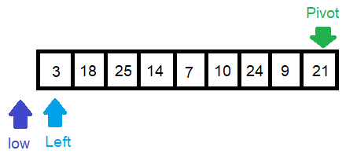

We set the rightest number as the "pivot" number and start to iterate the list.
The rule is: if the "left" number is smaller than the "pivot number", we move "low" number one unit forward
and swap the "left" number and the "low" number.

### Pass 2:

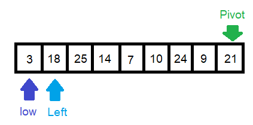

Since "18" is smaller than "21", the "low" value move to "18" and swap "low" and "left" number.
However, the "low" number is also the "left" number here so the swapping doesn't work.

### Pass 3:

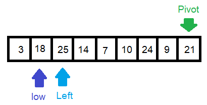

Now we move "left" number forward. Since "25" is larger than "21", we don't do swapping.

### Pass 4:

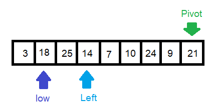
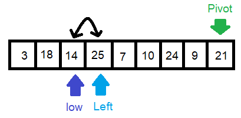

Now the "left" number is "14", which is smaller than "21", we move "low" number one unit forward and do the swapping with "left" number.

### Pass 5:

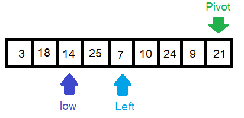
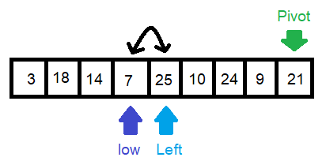

The "left" number moves forward again and becomes "7" here. It's smaller than the "pivot" number
, so we move "low" number one unit again and do the swapping as well.

### Pass 6:

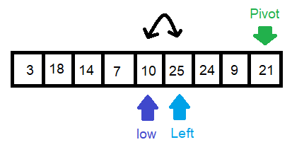

Again, since the "left" number, which is "10" now, is smaller than "21", we do the swapping with the new "low" number.

### Pass 7:
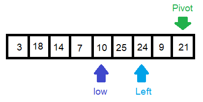

We move "left" number forward and now it's "24", which is larger than "21",
so we don't do anything and move forward.

### Pass 8:
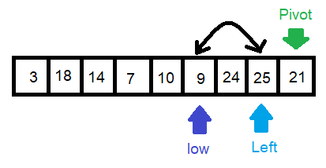

Now the "left" number is "9", which is smaller than the "pivot" number,
so we need to move "low" number one unit forward and do the swapping.

### Pass 9:
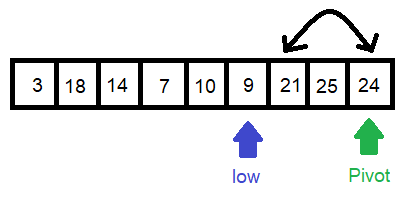

Finally, our "left" number reaches to the "pivot" number, meaning we iterate the whole list.
Now it's to wrap up. We just need to swap the pivot number with "low+1" number.

### Pass 10:

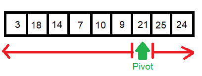

As you can see, our "pivot" number has a new position where every value to the left
is smaller than it and those values on the right are always larger.
Now repeat the same process again to the region on the left and the region to the right of the pivot
until we got the sorted list.

## Code

Click [sort_quick](../../python/code_challenges/sort_quick.py) to see the code.

Go to [test_sort_quick](../../python/tests/code_challenges/test_sort_quick.py) to run tests.

```
def quick_sort(list, left, right):
    if left < right:
        position = partition(list, left, right)
        quick_sort(list, left, position - 1)
        quick_sort(list, position + 1, right)
    return list

def partition(list, left, right):
    pivot = list[right]
    low = left - 1

    for i in range(left, right):
        if list[i] <= pivot:
            low+=1
            swap(list, i, low)
    swap(list, right, low+1)
    return low + 1

def swap(list, i, low):
    temp = list[i]
    list[i] = list[low]
    list[low] = temp
```

## Efficency
- Time: O(N^2): If we are lucky that the list is already sorted, we should get O(N*logN).
However, if the list has descending order, the worst case, then we need to go through all the numbers get O(N^2).
- Space: O(1): No additional place is needed for merge sort.
